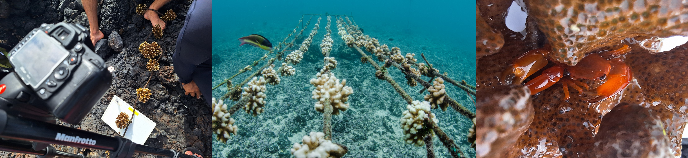

  

<h1>Galápagos Reef Revival – Data and Code Repository</h1>

This repository hosts open data and analysis scripts with reproducible workflows associated with Galápagos Reef Revival research and related monitoring efforts. Data and code will be released progressively as related reports, preprints, and peer-reviewed publications become publicly available.

Galápagos Reef Revival is a collaborative coral research, restoration, and education initiative focused on protecting and restoring vulnerable coral ecosystems in Isabela Island, Galápagos. The project pioneered coral gardening efforts in the Galápagos Islands and continues to develop long-term coral monitoring, restoration, biodiversity assessments, and applied conservation research in the Eastern Tropical Pacific.

Official website:
<a href="https://reefrevival.org/" target="_blank">https://reefrevival.org/</a>

<figure align="center" style="margin-bottom: 30px;">
  
</figure>
Photographs: ⓒ Daniel Velasco & Nicolás Dávalos

<h2>Repository Structure</h2>

Internal folder structures may vary among projects depending on the type of data, analyses, monitoring workflows, or publication outputs associated with each section.

- Information about the pilot project is <a href="https://davelascoc.github.io/galapagos-reef-revival/2022-23-pilot-study">here</a>.

<pre>
Galapagos-Reef-Revival/
│
├── coral-monitoring/          all related with coral growth, survival and health monitoring
│   ├── 2022-23-pilot-study/    pilot project
│   │   ├── Code/               R scripts and Markdown files with analysis' workflows
│   │   ├── Data/               raw and processed data of monitoring activities 
│   │   ├── Images/             Coral monitoring, restoration, and biodiversity images
│   │   └── Results/            images and tables
│   │
│   ├── nurseries/             expansion phase nurseries
│   └── corals_AI/             methods of AI to automate growth measurements
│
├── biodiversity/
│   ├── fishes/
│   └── inverts/
│
└── README.md
</pre>

<h2>Data Availability</h2>

The goal of this repository is to support transparency, reproducibility, collaboration, and public access to the scientific outputs produced by Galápagos Reef Revival. Because the project includes multiple research components, datasets and scripts will continue to be organized and published as new scientific products are completed.
  
Data availability may vary among folders depending on project stage and publication status. Some sections may initially contain metadata, documentation, or preliminary summaries until associated reports or manuscripts become publicly available.
  
If you use data, code, figures, or materials from this repository, please cite the corresponding report, thesis, preprint, publication, or dataset DOI when available.

<h2>Contacts</h2>

<ul>
  <li>
    <strong>Daniel Velasco</strong> – Scientific Analyst 
    <a href="mailto:daniel@reefrevival.org">daniel@reefrevival.org</a>
  </li>

  <li>
    <strong>Nicolas Davalos</strong> – Director 
    <a href="mailto:nicolas@reefrevival.org">nicolas@reefrevival.org</a>
  </li>

  <li>
    <strong>Catalina Ulloa</strong> – PhD Student 
    <a href="mailto:catalina@reefrevival.org">catalina@reefrevival.org</a>
  </li>

  <li>
    <strong>Margarita Brandt</strong> – Lead Scientist 
    <a href="mailto:maggy@reefrevival.org">maggy@reefrevival.org</a>
  </li>
</ul>

<figure align="center" style="margin-bottom: 30px;">
  
</figure>
Photography: ⓒ Nicolás Dávalos
